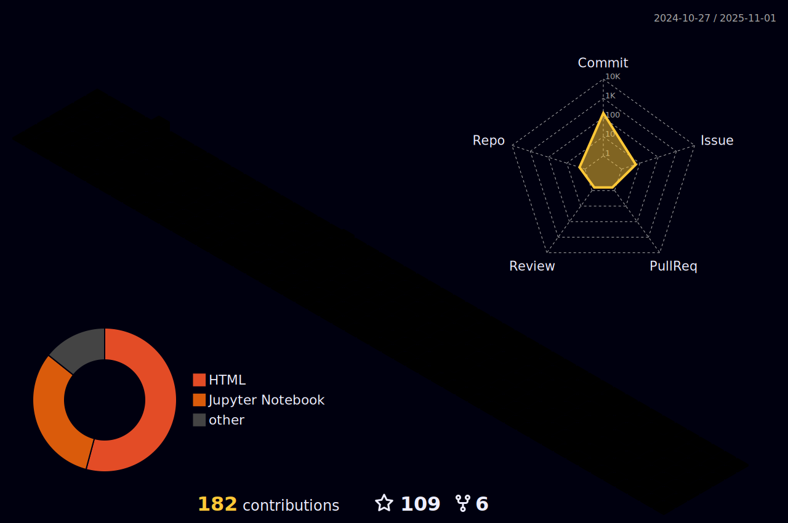

About 
======
- 🙋My name is Stephen. I am a zero-year Ph.D student from [Hong Kong Polytechnic University](https://www.polyu.edu.hk/).
- 🔍My research interests encompass Generative AI, Natural Language Processing, Large Language Models, AI Agents, and Multi-agent collaboration.
- 📖Before this, I got my Bachelor's degree in Computer Science & Technology and Master's degree in Data Science & Analytics.
- 🎠I enjoy writing blogs and sharing my moments in daily life at [小孙不够睡的Blog](https://stephen-smj.tech/).
-  More information about me can be found in [About me](https://stephen-smj.tech/about/).
-  Feel free to reach me at: [Telegram](https://t.me/StephenGo) or [s2371160103@163.com](s2371160103@163.com).

Tools I Use
======

